# 02 · ARC-AGI Task Taxonomy (working doc)

> **Purpose.** 这不是一份"分类完成品"，而是一个**诊断工具**。目的是在动手做 method 之前，把 ARC task 拆成
> `prior × transformation` 的二维网格，看清楚：(a) 现有方法族各自能覆盖哪些 cell、(b) 哪些 cell 是公认盲区，
> 从而为后续 novelty 选点提供依据。
>
> **Meta.** 种子 15 个 task 由 Claude 从 ARC-AGI-1 training 里挑选、跨 prior×transformation 分散选取。
> 每题的规则描述**必须**在 render 出图后由 YYH 亲自验证；实际规则若与描述不符，直接替换该 seed。
>
> **How to grow this doc.**
> ```
> # render 单题
> python scripts/render_task.py <task_id>
> # 批量 render 已列进 taxonomy 的题
> python scripts/render_task.py --ids 007bbfb7 00d62c1b ...
> ```
> 每次新加一题，做两件事：(1) 在 §2 coverage matrix 对应 cell 追加 task_id，(2) 在 §3 加一条 detail 条目。

---

## 1 · Axes

### 1.1 Priors (rows) — 来自 Chollet 2019 §III.1.2

| 代号 | Prior | 含义 |
|------|-------|------|
| **P1** | Objectness & elementary physics | 物体作为持久的、有界的、可移动的实体存在；接触/包含/遮挡；物体不会凭空消失 |
| **P2** | Agentness & goal-directedness | 场景中存在"意图"或"目标"（哪怕是隐含的），"应该发生什么" |
| **P3** | Numbers & counting | 计数、比较大小、排序、少量算术；离散数值 |
| **P4** | Basic geometry & topology | 对称/旋转/反射、连通性、包围、方向、拓扑等价 |

> 注：一个 task 通常横跨多个 prior。分类时列出所有**必需**的 prior，而不只是"最主要"的一个。

> **§1.3 · Note on prior consolidation.** Chollet 2019 §III.1.2 原文把 core knowledge priors 分成 4 个
> **独立**类别：*objectness*, *elementary physics*, *agentness*, *goal-directedness*。此处将它们**两两合并**
> 为 P1 (objectness + elementary physics) 和 P2 (agentness + goal-directedness)，理由如下：
>
> 1. **实证观察**：在 ARC-AGI-1 的 400 训练题里，几乎不存在"纯 physics 但不涉及 objects"或"纯 agent 但没有
>    goal"的任务——两者总是成对出现。保持独立会让 coverage matrix 出现大量结构性空 cell，稀释诊断价值。
> 2. **诊断目的**：本 taxonomy 的目的是**识别现有方法族的盲区**，而不是忠实复现 Chollet 的哲学分类。合并后
>    每个 prior 都对应"一族独立的能力短板"，更适合驱动 method 选择。
> 3. **可回退**：若日后发现某类 task 只需 physics 不需 objectness（或类似情况），可以在原地拆分回 4 类而不
>    破坏已有 task 的分类结果。
>
> **Trade-off**：这个改动会让"我为什么不完全 follow Chollet"成为一个需要解释的点。写论文/汇报时应显式指出
> 是"pragmatic consolidation for diagnostic purposes"，而不是宣称 Chollet 分错了。

### 1.2 Transformation types (columns)

| 代号 | Transformation | 含义 |
|------|----------------|------|
| **T1** | Symmetry / rotation / reflection | 旋转 90/180/270、水平/垂直/对角镜像 |
| **T2** | Gravity / movement | 物体沿某方向平移，直到碰到边界或另一物体 |
| **T3** | Recolor / color mapping | 颜色替换/交换/按某规则重着色，形状不变 |
| **T4** | Crop / extract | 输出是输入的子区域（bounding box、某特定 object） |
| **T5** | Fill / completion | 补全缺失部分（内部填充、对称补齐） |
| **T6** | Count-then-act | 先数一个数，再根据这个数决定后续动作（重复次数、颜色 index、大小） |
| **T7** | Tile / repeat / scale | 按某模板重复或缩放 |
| **T8** | Connect / draw | 在网格上画新的线/边框/路径（新增像素，非移动/重着色） |

---

## 2 · Coverage matrix (二维分类)

单元格填当前已归类的 task_id。空白 cell = **未覆盖或待发现**（后期做 method 时要重点关注哪些 cell 全空）。

|              | T1 sym/rot | T2 gravity | T3 recolor | T4 crop | T5 fill | T6 count→act | T7 tile | T8 connect |
|--------------|------------|------------|------------|---------|---------|--------------|---------|------------|
| **P1 object**|            |            | `b1948b0a` | `1cf80156` |     |              | `007bbfb7`, `28bf18c6` |            |
| **P2 goal**  |            | `1e0a9b12`, `5521c0d9` |    |         |         |              |         |            |
| **P3 number**|            |            | `9565186b` |         |         | `08ed6ac7`, `6e02f1e3` |    |     |
| **P4 geom**  | `3af2c5a8`, `6150a2bd` |  |     |         | `00d62c1b` |         |         | `4258a5f9`, `d4f3cd78`, `ded97339` |

**Coverage 观察（首轮）**：
- T1 目前只有纯几何题 → **P1×T1**（物体级对称，比如"把某个 object 镜像"）是常见但**这里没覆盖**，需要补一题
- T3（recolor）几乎没跟 T6（count）以外的 prior 交叉 → **P2×T3**（"根据 agent 应该到的位置来 recolor"）是难点
- **P3×T2**（数量决定移动距离/次数）全空——这是 count-then-act 的高阶变体，值得日后单独找题
- T7（tile）只挂在 P1，**P4×T7**（对称性驱动的 tiling，比如"按镜像方向扩展"）值得补

---

## 3 · Task details (seed × 15)

> 每条模板：
> - **Image**: `` — render 出来后自动出现
> - **Priors / Transformations**: 二维坐标
> - **Grid size**: 输入 → 输出尺寸
> - **Rule (candidate)**: Claude 的猜测；YYH 验证后修正
> - **Solver notes (YYH)**: 你手解的时间、卡点、用了什么直觉
> - **Method-family fit**: 哪一族方法应该能拿下这题（DSL / LLM 直推 / TTT / brute-force search）

---

### 3.1 `007bbfb7` — Self-tiling by input pattern
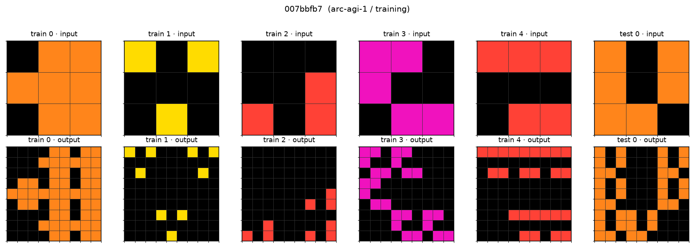
- **Priors**: P1, P4  **Transformations**: T7
- **Grid**: 3×3 → 9×9
- **Rule (candidate)**: 把输入本身当作一个 3×3 的 "mask"，在 9×9 输出里，只有输入中非零的那些位置上才复制一份原图；其余位置全零。即 output = kron(input≠0, input)。
- **Solver notes (YYH)**: _[待填]_
- **Method-family fit**: DSL 一句话；LLM 需要理解 self-reference，中等；TTT 应能学。

### 3.2 `00d62c1b` — Enclosed region fill (topology)
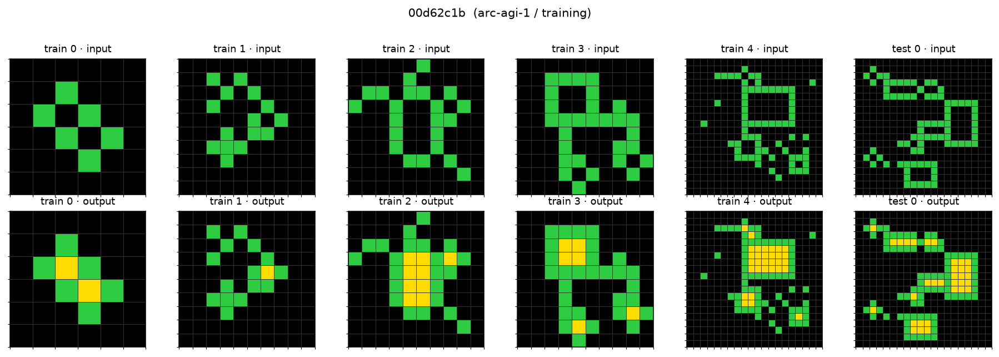
- **Priors**: P4  **Transformations**: T5
- **Grid**: variable
- **Rule (candidate)**: 输入是绿色不规则闭合曲线；把所有被绿色完全包围的黑色区域填成黄色，未被包围的黑色保持不变。
- **Solver notes (YYH)**: _[待填]_
- **Method-family fit**: DSL 需要 flood-fill + connected-component-with-boundary，可以做；纯 LLM 对拓扑理解很脆。

### 3.3 `08ed6ac7` — Rank bars by length, recolor by rank
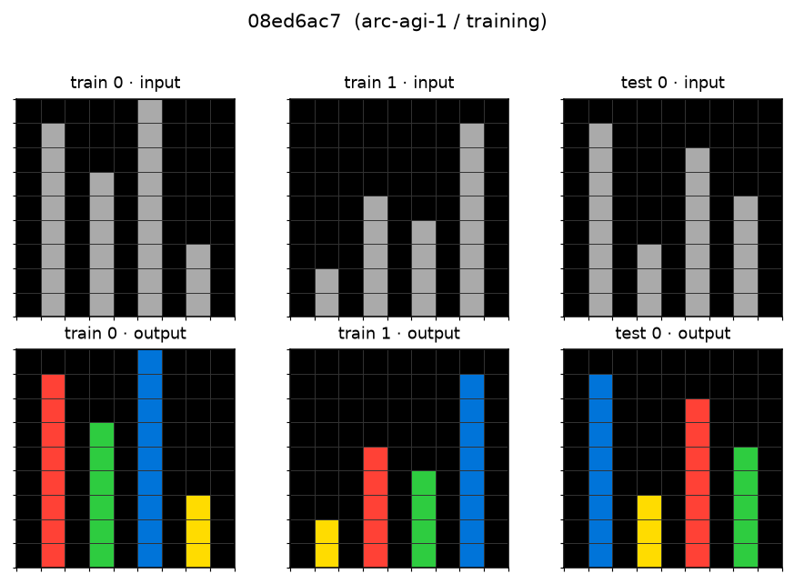
- **Priors**: P3, P1  **Transformations**: T6, T3
- **Grid**: same size
- **Rule (candidate)**: 输入若干竖直柱状条(灰色)，按高度排序；最高的染红、第二高染绿、第三高染蓝、第四高染黄（或类似固定映射）。
- **Solver notes (YYH)**: _[待填]_
- **Method-family fit**: DSL 需要 sort + zip；这是典型的"两阶段"任务，是 count-then-act 的代表。

### 3.4 `1cf80156` — Crop to non-background object
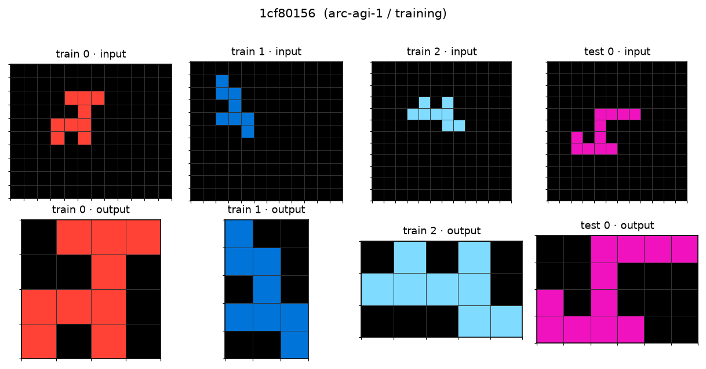
- **Priors**: P1  **Transformations**: T4
- **Grid**: large → tight bbox
- **Rule (candidate)**: 输入大背景（黑）中有一个非零 object；输出 = 该 object 的 bounding box。
- **Solver notes (YYH)**: _[待填]_
- **Method-family fit**: DSL 单行；几乎所有方法都能过。Baseline 用它 sanity check。

### 3.5 `1e0a9b12` — Gravity down
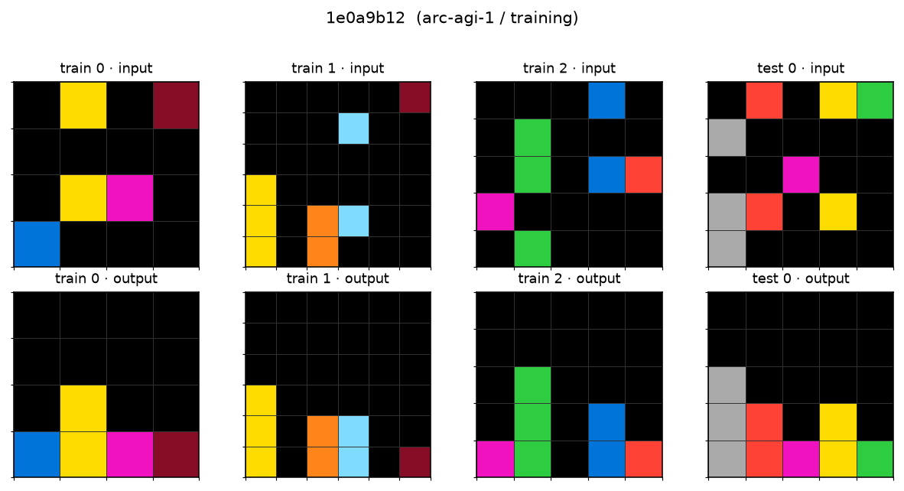
- **Priors**: P2, P1  **Transformations**: T2
- **Grid**: same size
- **Rule (candidate)**: 每一列里所有非零像素沉到列底，保持原有相对上下顺序。
- **Solver notes (YYH)**: _[待填]_
- **Method-family fit**: DSL 天然；LLM 理解"方向"经常翻车（会误上下）。

### 3.6 `28bf18c6` — Mirror duplicate
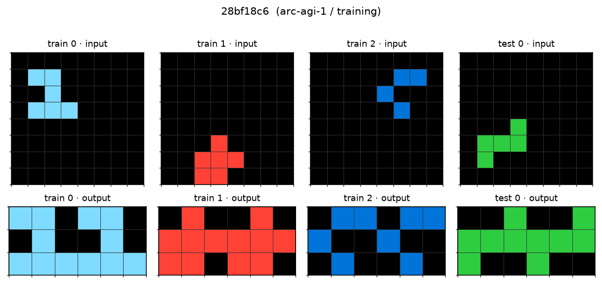
- **Priors**: P1, P4  **Transformations**: T7
- **Grid**: input → 2× wide
- **Rule (candidate)**: 输入是一个 shape；输出把 shape 和它的水平镜像并排放置。
- **Solver notes (YYH)**: _[待填]_

### 3.7 `3af2c5a8` — Complete to fourfold symmetry
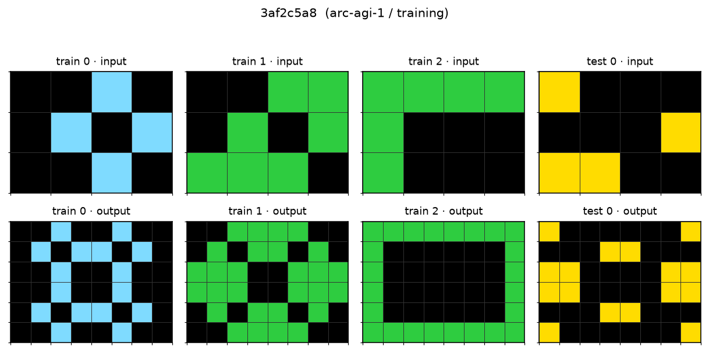
- **Priors**: P4  **Transformations**: T1, T5
- **Grid**: input → 2× on both axes（一般 3×3 → 6×6）
- **Rule (candidate)**: 把输入拼上它的水平、垂直、双向镜像，形成 2h×2w 的四折对称图。
- **Solver notes (YYH)**: _[待填]_

### 3.8 `4258a5f9` — Draw border around each dot
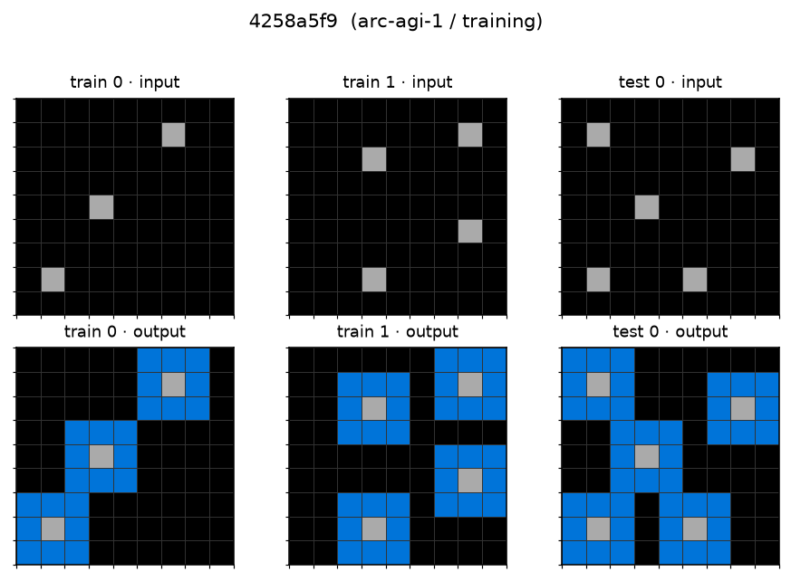
- **Priors**: P1, P4  **Transformations**: T8
- **Grid**: same size
- **Rule (candidate)**: 每个孤立像素被一圈灰色环绕（8-neighbor）。
- **Solver notes (YYH)**: _[待填]_

### 3.9 `5521c0d9` — Gravity up + something (verify!)
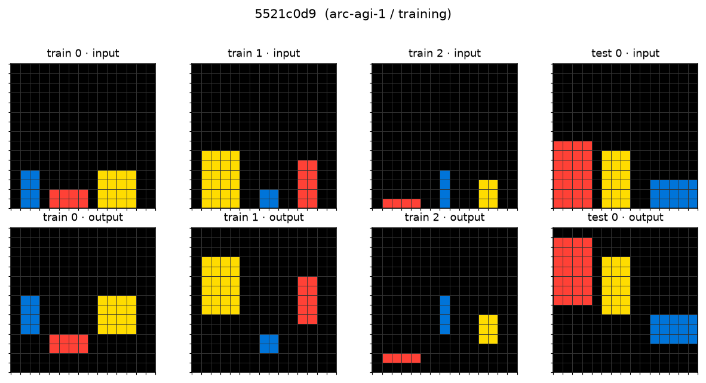
- **Priors**: P2, P1  **Transformations**: T2
- **Grid**: same size
- **Rule (candidate)**: 每列物体上浮到列顶（gravity 反方向）。⚠️ 我不完全确定，可能还叠加一个"上浮后色块变高"的规则；render 后核对。
- **Solver notes (YYH)**: _[待填]_

### 3.10 `6150a2bd` — 180° rotation
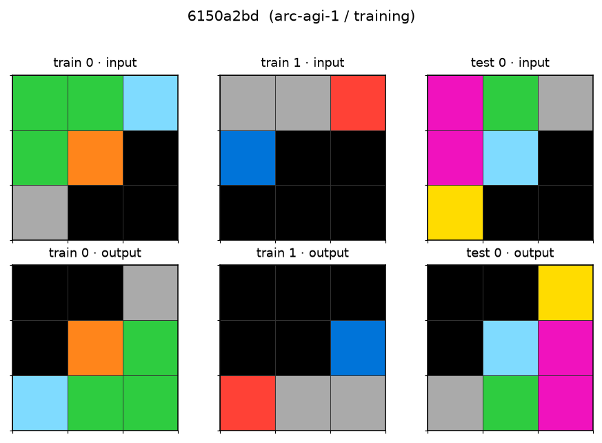
- **Priors**: P4  **Transformations**: T1
- **Grid**: same size
- **Rule (candidate)**: 输出 = 输入旋转 180°。
- **Solver notes (YYH)**: _[待填]_
- **Method-family fit**: 最简单的对称题，sanity check 用。

### 3.11 `6e02f1e3` — Color count → diagonal pattern
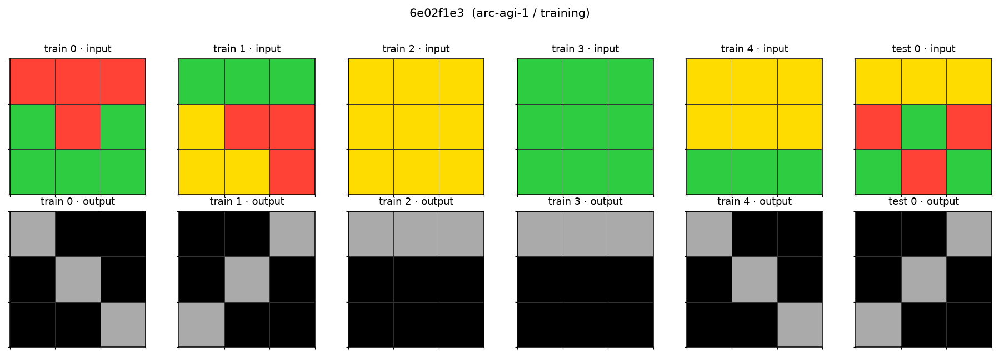
- **Priors**: P3  **Transformations**: T6
- **Grid**: 3×3 → 3×3
- **Rule (candidate)**: 数输入里不同颜色的种数 k；根据 k 输出一个固定 3×3 模板（k=1 全灰、k=2 一条对角线、k=3 另一种模式）。⚠️ 精确映射需 render 核对。
- **Solver notes (YYH)**: _[待填]_
- **Method-family fit**: 纯 count-then-lookup，DSL 需要枚举，LLM 反而容易。

### 3.12 `9565186b` — Keep majority, recolor rest
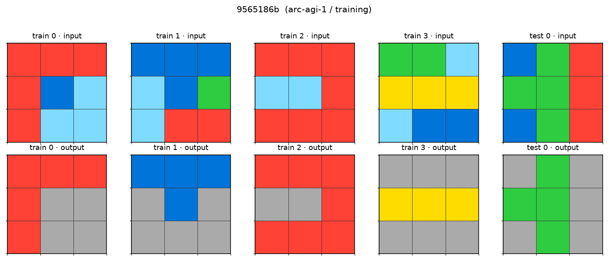
- **Priors**: P3, P1  **Transformations**: T3
- **Grid**: same size
- **Rule (candidate)**: 找出出现次数最多的颜色，保留；其余所有非零像素改成灰色（5）。
- **Solver notes (YYH)**: _[待填]_

### 3.13 `b1948b0a` — Simple recolor swap
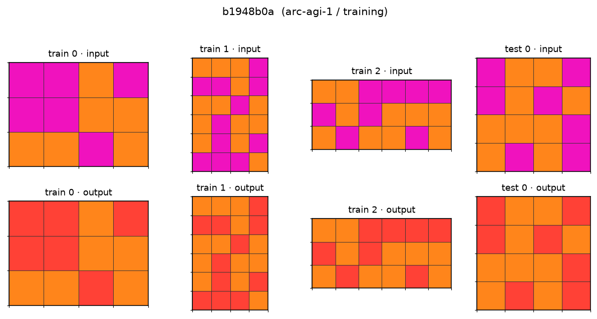
- **Priors**: P1  **Transformations**: T3
- **Grid**: same size
- **Rule (candidate)**: 把某种颜色（如洋红 6）全部换成另一种（如红 2），其他不变。
- **Solver notes (YYH)**: _[待填]_
- **Method-family fit**: DSL trivial；用来隔离"颜色映射"这一原子操作。

### 3.14 `d4f3cd78` — Extend line to nearest wall, then fill gap
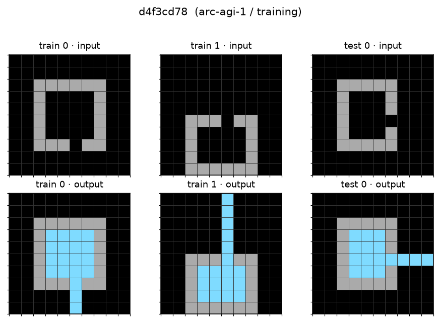
- **Priors**: P4, P1  **Transformations**: T8, T5
- **Grid**: same size
- **Rule (candidate)**: 输入是一段绿色开口的 U 形；从开口延伸一条线直到网格边缘，然后把 U 内部（原本开口的一侧）填上另一颜色。⚠️ 记不清细节，render 后核对。
- **Solver notes (YYH)**: _[待填]_

### 3.15 `ded97339` — Connect collinear dots
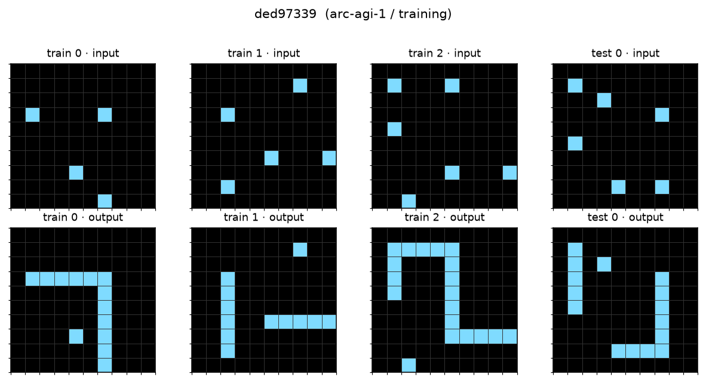
- **Priors**: P4  **Transformations**: T8
- **Grid**: same size
- **Rule (candidate)**: 输入若干蓝点；同一行或同一列上的成对蓝点之间画蓝线连起来。
- **Solver notes (YYH)**: _[待填]_

---

## 4 · What to do with this doc

**Meeting deliverable (7/10)**：
- 从上面 15 题里挑 **3-4 题最有代表性的**做 meeting slide（推荐：`007bbfb7`(self-ref) + `08ed6ac7`(count-then-act) + `d4f3cd78`(connect+fill) + `1e0a9b12`(gravity)）——覆盖 4 种典型难点类型。
- Coverage matrix 直接搬到 slide 里，作为"我理解 ARC 是什么"的证据。

**下一步扩展（meeting 之后）**：
1. 补齐 coverage matrix 里明显缺的 cell（尤其 P3×T2、P4×T7、P1×T1）——目标 30 题左右封版。
2. 给每个 task 加一列 "**human-solve time**"，看看**你人类**觉得最难的那几题是不是 method 上也最难；这本身是有 diagnostic value 的观察。
3. 加一列 "**estimated DSL length**"——如果你用一个 100-primitive 的 DSL（参见 Hodel 2024），每题大致需要多少条指令。这个 metric 后面写 paper 直接能用。

## 5 · Open questions（待和陈老师讨论 / 待自己想清楚）

- ARC-AGI-**2** 是否遵循同一 taxonomy？还是引入了新 prior / 新 transformation？（v2 官方声称任务更"抽象"，需实证）
- Chollet 的 4-prior 是否够用？还是缺一个 "P5: composition" 来描述多步组合？(Kevin Ellis 系列工作的假设)
- 一个 task 的 "hardness" 除了 DSL length 之外还应该用什么 metric？(candidates: min-# examples to disambiguate, human solve time, entropy of legal outputs given only test input)
